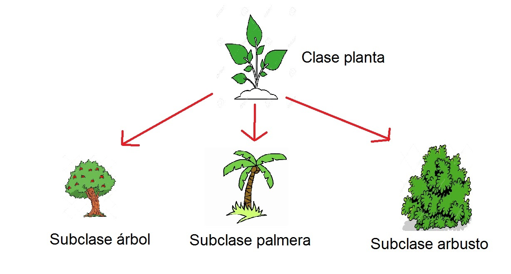

# Unidad 1: Introducción al paradigma de la programación orientado a objetos

## Instituto tecnológico de Tijuana

Alumno: Salasar Ramírez Octavio

Número de control: 18212265
___

### Tarea 1

___

#### *Paradigma*

Para mi, un paradigma es un conjunto de ideas, cosas, modelos, reglas, que definen un estado de cosas, se habla por ejemplo del cambio de paradigma en la ciencia, donde antes se creía que la Tierra era el centro del Universo, y la ciencia de esos tiempos se basaban en una serie de premisas que iban acorde con esa idea, tuvo que pasar tiempo para que las insconsistencias y errores de este paradigma dieran paso a uno nuevo que es el modelo Heleocentrico de Galilei. De igual forma depende el tipo de paradigma, este puede cambiar, conservarse o desecharse. El paradigma de la POO (programación orientada a objetos) representa una forma diferente de programar más inclinada a abstraer y representar objetos del mundo real con sus interacciones.

_Fuente:_
>(Anónimo) (24 de febrero) Etimología de paradigma. _Etimologías._ <http://etimologias.dechile.net/?paradigma>

#### *Abstracción*

La abstracción en la capacidad de la mente humana de aislar lo escencial de lo secundario de las cosas. Abstraer es identificar con la razón las cualidades escenciales que nos sirven de las que no para poder representar objetos, situaciones o cosas. Podríamos decir que la escritura es un sistema de abstracción, ya que de los objetos sólo tomamos la palabras que usamos para nombrar la realidad y en base de un sistema de signos los plasmamos en papel para poder comunicarnos sin tener que representar las cosas por medio de dibujos que serían más complicados e inexactos. Otro ejemplo de la abstracción serían las matemáticas que nacieron de un proceso de este tipo, en algún momento de la historia se pasó de represntar a las ovejas y las vacas que se tenían a representarlas por medio de piedritas u objetos más pequeñas que sólo representaban al elemento en sí, luego se paso a un sistema de númeración decimal que representaba más eficientemente las cantidades, así, si se tenían que contar cosas como la fortuna en oro de un rey, era más eficiente usar símbolos que cabían en un pequeño espacio. La abstracción es una de las habilidades que ha echo que la sociedad avance en un muchos sentidos.

_Fuente:_
>(Anónimo) (Sin fecha) Pensamiento abstracto. _EcuRed._ <https://www.ecured.cu/Pensamiento_abstracto>

#### *¿Por qué decimos que la Clase es el mecanismo de abstracción de los lenguajes OO?*

Debido a que las clases funcionan como plantillas o moldes de objetos del mundo real, creados a partir de la abstracción de las características y comportamientos más importantes del objeto u ente que queramos representar. Las clases en c# se compone de los atributos y métodos, que en la programación son una forma de representar características de la realidad para poder trabajar con ella.

#### *Encapsulamiento*

El encapsulamiento es la capacidad de las clases de ocultar, por así decilo el acceso a los atributos de los objetos, para que el usuario no se preocupe por las características internas. Como ejemplo tenemos este reloj donde el funcionamiento interno no es visible para las personas no interesadas en él, lo que nosotros vemos es la presentación del reloj y las manecillas que nos sirven para ver la hora.

>
>

Es importante el encapsulamieto debido a que protege la integridad del código, debido a que se evita que se manipule de forma correcta, además que le resulta más fácil al usuaio la interacción.

#### *Herencia*

La herencia es un poderoso método de creación de clases, el cual nos permite basarnos en una clase padre para crear una subclase que "hereda" los atributos o métodos de la clase padre, más aparte tiene sus características particulares.

___

